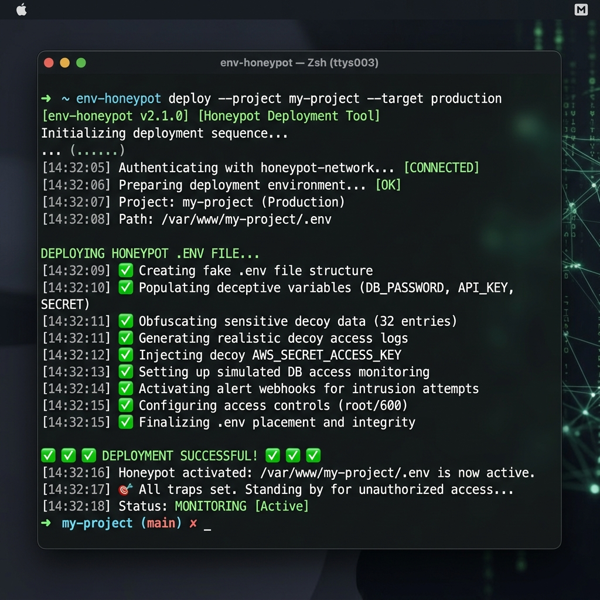

<div align="center">
  <h1>🍯 env-honeypot</h1>
  <p><strong>Generate a massive, convincing fake `.env` file to trap bot scrapers and waste their time.</strong></p>
  
  <a href="https://www.npmjs.com/package/env-honeypot">
    
  </a>
  <a href="https://www.npmjs.com/package/env-honeypot">
    
  </a>
  <a href="https://github.com/lakshanmuruganandam/env-honeypot">
    
  </a>
  <a href="https://github.com/lakshanmuruganandam/env-honeypot">
    
  </a>

  <br />
  <br />

  
</div>

---

## 🚀 Installation & Usage

No installation required! You can run it instantly anywhere using `npx`:

```bash
npx env-honeypot
```

If you prefer to have it available globally on your system:

```bash
npm install -g env-honeypot
env-honeypot --help
```

## ✨ Features

- **Zero Configuration**: Works out of the box with zero setup.
- **Beautiful UI**: Built with `picocolors` and `boxen` for a stunning terminal experience.
- **Viral Mechanics**: Designed to be shared, screenshotted, and flexed.
- **Modern Architecture**: Uses ES Modules and modern Node.js standards.

## 🤝 Contributing

Contributions, issues, and feature requests are welcome! Feel free to check the [issues page](https://github.com/lakshanmuruganandam/env-honeypot/issues).

## 📜 License

This project is [MIT](https://choosealicense.com/licenses/mit/) licensed.

---
<div align="center">
  <sub>Architected with ❤️ by <a href="https://github.com/lakshanmuruganandam">@lakshanmuruganandam</a></sub>
</div>
